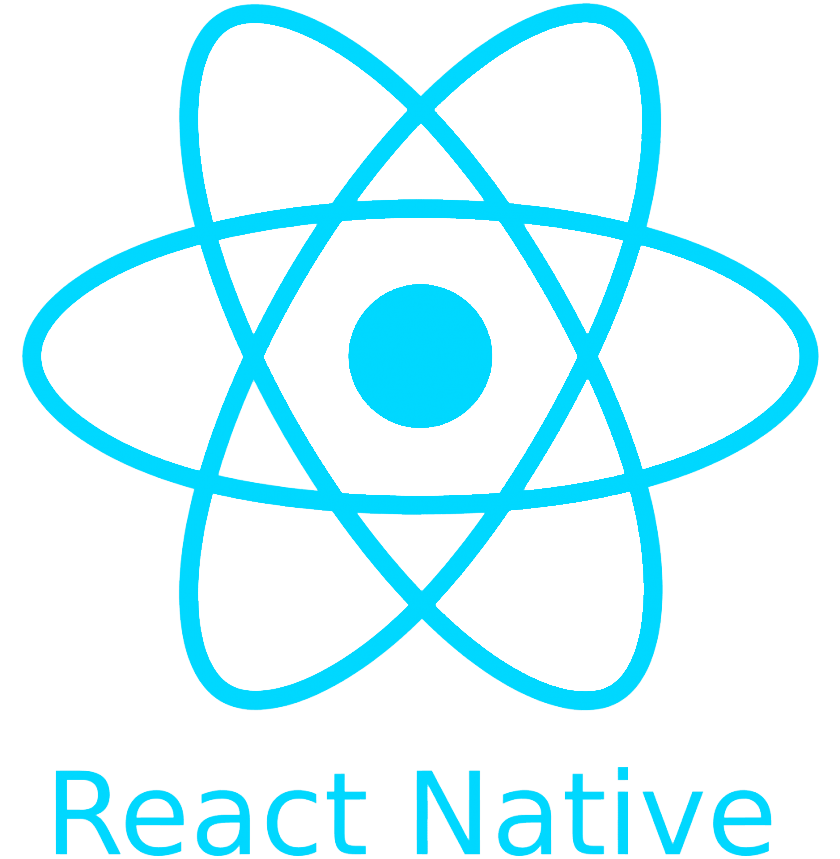

 

I'm a self-taught passionate React.js & React-Native developer from Turkey 🇹🇷

**About me**

- 💼 Co-Founder at [NarX Tech](https://narxtech.com/)

- ❤️ I love writing Javascript, and building fun experiments on type-level

- 💬 Ask me about anything [here](https://github.com/NurettinKaynar/NurettinKaynar/issues)

<code></code>
<code></code>
<code></code>
<code></code>
<code></code>
<code></code>
<code></code>
<code></code>
<code></code>
<code></code>

|  |  |
| ------------- | ------------- |

#### Top Repositories

 
 

